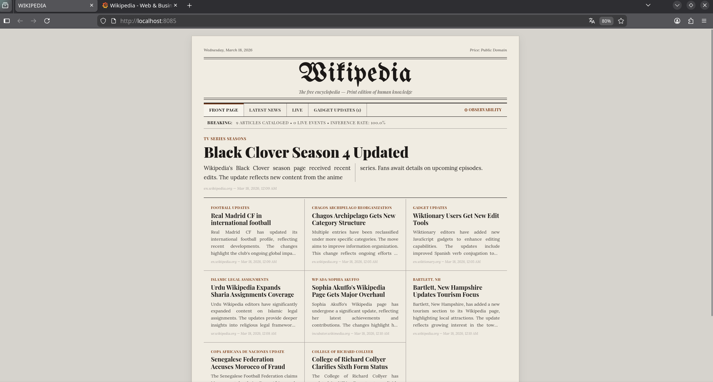
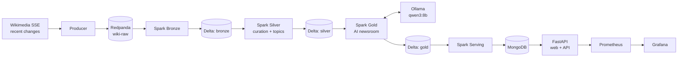
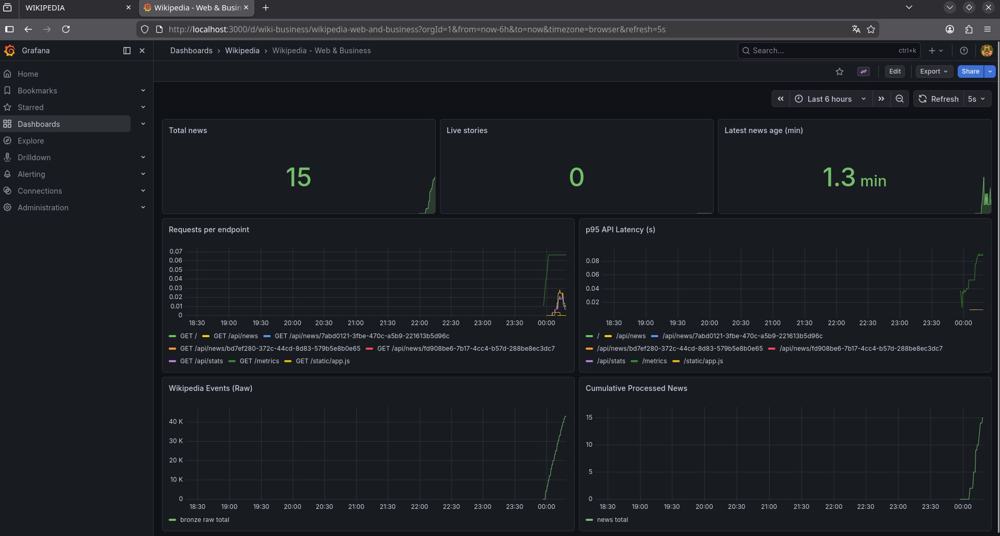
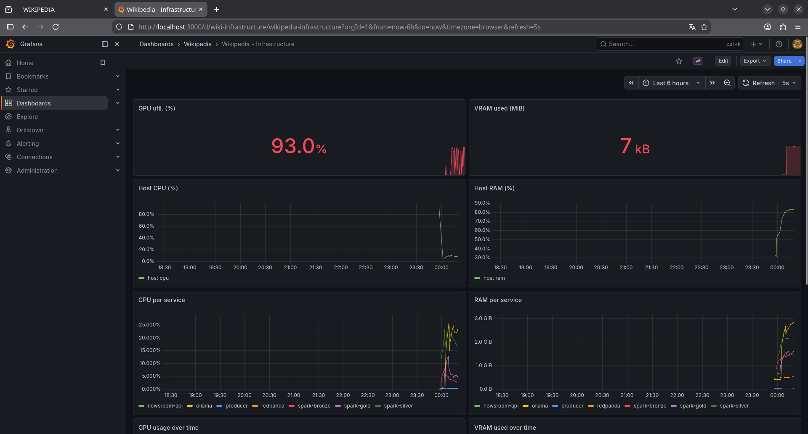
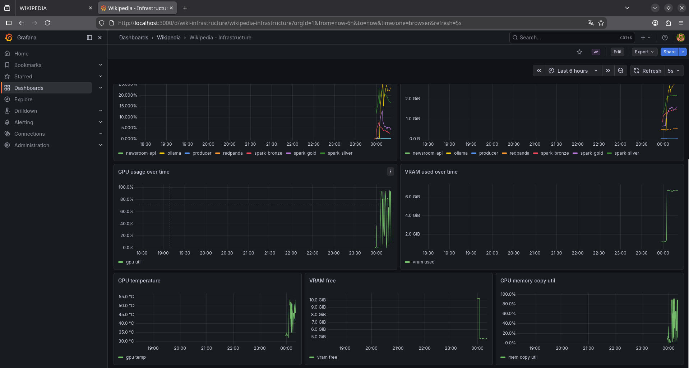
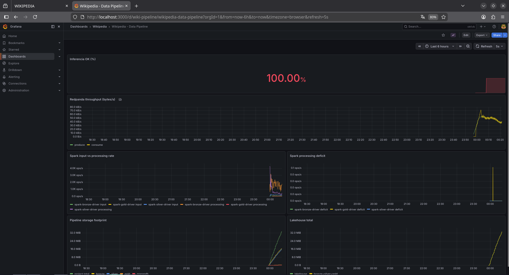

# Wiki Stream MLOps

[](https://github.com/JesusJimenez01/wiki-stream-mlops/actions/workflows/ci.yml)


[](LICENSE)

A real-time data platform that transforms Wikipedia edits into automatically generated news stories in English.

**Wikipedia SSE -> Redpanda -> Spark (Bronze/Silver/Gold) -> MongoDB -> FastAPI/Web -> Prometheus/Grafana**



## Highlights

* **End-to-end streaming pipeline**: 19 services orchestrated with Docker Compose, from a live
  Wikimedia event stream to a web newsroom, with a medallion lakehouse (Delta Lake on MinIO) in between.
* **Editorial intelligence before the LLM**: Silver keeps human edits to encyclopedia articles using the
  event's structured fields (`wiki`, `type`, `namespace`), drops edits reverted during a maturation window and
  ranks articles by how many *different* editors converge on them, the classic breaking-news signal.
* **Grounded local LLM with guardrails**: news drafted by Ollama (`qwen3:8b`) from the article's lead and the
  text the edits actually added (Wikimedia REST API), constrained by a JSON schema; templated or off-language
  answers are never published as a success, and a failure never breaks a micro-batch.
* **Measurable selection**: offline tools record the live stream and replay it through the production Silver
  code, so thresholds are tuned by measuring precision on labelled samples instead of by eye.
* **Story lifecycle**: deduplication, controlled updates of live stories and idempotent publishing
  (`story_id:update_seq`), so replays never duplicate news.
* **Full observability**: provisioned Grafana dashboards for the pipeline, the infrastructure (host,
  containers, GPU) and product KPIs such as inference success rate and news freshness.
* **Tested**: unit tests for the producer, Spark jobs and API, Spark + Delta integration tests and frontend tests,
  all running in CI.

---

## 1. Problem Statement

This project implements an automated newsroom using a medallion lakehouse architecture:

* **Ingestion** of real-time events from Wikipedia.
* **Editorial curation** to remove technical noise (bots, minor changes, reverts, namespace noise).
* **AI News Generation** (headline, summary, and tags).
* **Web/API Serving** for human consumption and business observability.
* **Full observability** across the pipeline, infrastructure, and inference quality.

Academic goal: to demonstrate an end-to-end Big Data flow focusing on data quality, operations, and business value.

---

## 2. Layered Architecture



### 2.1 Layer View

1. **Ingestion**
   * `producer/producer.py` listens to Wikipedia SSE and publishes to Redpanda.

2. **Bronze (raw)**
   * `spark-jobs/bronze_ingestion.py` persists raw events to Delta Lake (MinIO).

3. **Silver (curation + topic discovery)**
   * `spark-jobs/silver_processing.py` keeps human article edits, classifies noise and detects editing bursts
     (see [5.1 How a Story Is Selected](#51-how-a-story-is-selected)).
   * Generates `silver/wiki_clean` and `silver/wiki_topics`.

4. **Gold (AI newsroom)**
   * `spark-jobs/gold_enrichment.py` consumes Silver topics, fetches the article lead and the latest diffs
     (`spark-jobs/common/wiki_context.py`) and calls Ollama.
   * Applies deduplication, update control, and story lifecycle management.
   * Generates `gold/wiki_news` and inference metrics.

5. **Serving**
   * `spark-jobs/mongo_serving.py` publishes to MongoDB with idempotent upserts.
   * Main collection: `wikipedia.news`.

6. **Consumption and Observability**
   * `newsroom-api/app.py` exposes web, API, and metrics.
   * Prometheus + Grafana + exporters (host/containers/GPU).

### 2.2 E2E Data Flow

1. Wikipedia event enters via SSE.
2. Published to Redpanda.
3. Bronze stores it retaining full historical detail.
4. Silver filters noise and detects articles that several editors are changing at once.
5. Gold grounds the story on the article and its diffs, drafts it and manages live story updates.
6. Serving publishes to MongoDB for the web/API.
7. Grafana displays technical health and product KPIs.

---

## 3. Components and Technologies

* **Local Orchestration:** Docker Compose
* **Streaming Bus:** Redpanda
* **Processing:** Apache Spark Structured Streaming
* **Lakehouse:** MinIO + Delta Lake
* **Local AI:** Ollama (`qwen3:8b`)
* **Serving:** MongoDB + FastAPI
* **Observability:** Prometheus + Grafana + Node Exporter + cAdvisor + DCGM Exporter

---

## 4. Quick Start

### 4.0 Prerequisites

* Docker with Docker Compose v2.24+ (Linux) or Docker Desktop (Windows with WSL 2, macOS).
* Recommended: an NVIDIA GPU for Ollama. On Linux install the
  [NVIDIA Container Toolkit](https://docs.nvidia.com/datacenter/cloud-native/container-toolkit/);
  Docker Desktop on Windows only needs the regular NVIDIA driver. Without a GPU, see 4.4.
* RAM: 32 GB is comfortable with the defaults. On 16 GB, lower the Spark memory in `.env`
  (`SPARK_WORKER_MEMORY=4G`, `BRONZE_EXECUTOR_MEMORY=2g`, `SILVER_EXECUTOR_MEMORY=1g`, `GOLD_EXECUTOR_MEMORY=1g`).

> The credentials in `.env.example` are local development defaults. Change them before exposing
> any port beyond your machine.

### 4.1 Startup

From the `wiki-stream-mlops` folder:

1. Create your environment file from the template:
```bash
cp .env.example .env
```

2. Start the infrastructure (it will build images if necessary):
```bash
docker compose up -d
```

3. Download the AI model into the Ollama container (only required the first time):
```bash
docker exec -it wiki-ollama ollama pull qwen3:8b
```
The model stays in the Ollama data volume, so it is preserved if you only remove the data volumes below.

### 4.2 Main Endpoints

* Web: `http://localhost:8085`
* News API: `http://localhost:8085/api/news?limit=25`
* Stats API: `http://localhost:8085/api/stats`
* Metrics: `http://localhost:8085/metrics`
* Grafana: `http://localhost:3000`
* Prometheus: `http://localhost:9090`
* Redpanda Console: `http://localhost:8888`
* Spark UI (master): `http://localhost:8080`
* MinIO Console: `http://localhost:9001`

### 4.3 Clean Data Reset (Keeping AI model)

```bash
docker compose down --remove-orphans
docker volume rm $(docker volume ls -q | grep -E '_?(redpanda_data|minio_data|mongo_data|prometheus_data|grafana_data)$')
docker compose up -d --build
```

This reset **does not** delete the `*_ollama_models` volume.

### 4.4 Docker Desktop (Windows / macOS) and Machines Without a GPU

Two override files adapt the stack without editing `docker-compose.yml`:

| File | Use it when | What it changes |
|------|-------------|-----------------|
| `docker-compose.desktop.yml` | Running on Docker Desktop | Drops cAdvisor's `/dev/disk` mount (absent in the Desktop VM) and disables the DCGM exporter (unsupported on WSL 2) |
| `docker-compose.cpu.yml` | There is no NVIDIA GPU | Runs Ollama on CPU; also set `OLLAMA_MODEL=qwen3:1.7b` and `OLLAMA_TIMEOUT_SECONDS=180` in `.env` |

```bash
# Docker Desktop with an NVIDIA GPU
docker compose -f docker-compose.yml -f docker-compose.desktop.yml up -d --build

# Docker Desktop without a GPU
docker compose -f docker-compose.yml -f docker-compose.desktop.yml -f docker-compose.cpu.yml up -d --build
```

Use the same `-f` flags for every later `docker compose` command (`ps`, `logs`, `down`).

---

## 5. Recommended Configuration

1. Copy `.env.example` to `.env`.
2. Keep `SILVER_EVENT_HOLD_MINUTES=5` as a stable baseline.
3. Adjust only if necessary:
   * scope (`SILVER_ALLOWED_WIKIS`, e.g. `enwiki,eswiki`)
   * volume (`SILVER_TOPIC_TOP_N`, `GOLD_MAX_EVENTS_PER_BATCH`)
   * editorial rigor (`SILVER_TOPIC_MIN_EDITORS`, `SILVER_TOPIC_MIN_EDITS`, Gold deduplication thresholds)
   * model (`OLLAMA_MODEL`): any Ollama model that supports structured outputs works; compare candidates with
     the Gold quality report before switching.

Note: in `newsroom-api`, the feed prioritizes pieces with valid inference and keeps obvious noise off the front page.

### 5.1 How a Story Is Selected

| Stage | Signal | Setting |
|-------|--------|---------|
| Scope | Wiki (`enwiki`…), change `type` (`edit`, `new`) and `namespace` (0 = articles) from the event itself | `SILVER_ALLOWED_WIKIS`, `SILVER_ALLOWED_TYPES`, `SILVER_ALLOWED_NAMESPACES` |
| Noise | Bots, minor edits, numeric titles, maintenance topics, technical edit summaries | editorial rules in `common/editorial_common.py` |
| Stability | Edits followed by a revert on the same article within the hold window are dropped | `SILVER_EVENT_HOLD_MINUTES` |
| Burst | Article edited by at least N **distinct** editors and M edits inside the window | `SILVER_TOPIC_MIN_EDITORS`, `SILVER_TOPIC_MIN_EDITS`, `SILVER_TOPIC_LOOKBACK_MINUTES` |
| Ranking | `3 × editors + 0.5 × edits (capped) + bytes added (capped) + title quality` | `SILVER_TOPIC_TOP_N` |
| Facts | Article lead + text added by the largest recent edits, sent to the LLM | `GOLD_WIKI_CONTEXT_ENABLED`, `GOLD_CONTEXT_MAX_DIFFS`, `GOLD_CONTEXT_MAX_CHARS` |
| Publishing | Headlines/summaries the guardrails had to replace are stored with `inference_ok=false` and stay off the front page | — |

Counting distinct editors instead of edits follows research on breaking-news detection from Wikipedia edit
spikes (Steiner, van Hooland and Summers, *"MJ no more"*, WWW 2013): one person saving a draft thirty times
is not news; several people converging on the same article usually is.

### 5.2 Tuning the Selection Offline

The selection can be measured without the stack, replaying recorded events through the same Silver code:

```bash
# 1. Record a sample of the live stream (standard library only)
python tools/record_stream.py --minutes 60 --out data/recentchange.jsonl

# 2. Replay it in 5-minute windows and write one row per selected article
docker compose run --rm selection-lab select --input /opt/data/recentchange.jsonl --out /opt/data/candidates.csv

# 3. Fill the "newsworthy" column (y/n) and measure precision and precision@k
docker compose run --rm selection-lab score --labels /opt/data/candidates.csv --k 10

# 4. Compare another configuration with the same labels (e.g. the edit-count baseline)
docker compose run --rm selection-lab select --input /opt/data/recentchange.jsonl --out /opt/data/baseline.csv \
    --wikis '*' --types '*' --min-editors 1 --min-edits 3
docker compose run --rm selection-lab score --labels /opt/data/candidates.csv --candidates /opt/data/baseline.csv
```

`selection-lab` is a Compose service in the `tools` profile (never started by `up`) that uses the same Spark
image and the same `SILVER_*` settings as the Silver job. With `--bronze` instead of `--input` it replays the
Bronze table of a running stack. With PySpark and Java installed locally, `python tools/offline_topics.py …`
works the same.

---

## 6. Testing and Quality

### 6.0 Automated Tests (no running stack needed)

| Suite | What it covers | Command |
|-------|----------------|---------|
| Unit | Editorial rules and change filter, burst scoring, Gold LLM handling (schema, guardrails, grounding), Wikimedia diff parsing, deduplication, producer back-pressure, Mongo serving, API endpoints and metrics, offline tools, Compose/`.env.example` drift | `pytest -m "not spark"` |
| Integration | Real Spark + Delta Lake: Silver filtering, distinct-editor bursts and revert tainting, the offline replay tool, and the serving stream surviving Gold's `UPDATE` | `pytest -m spark` (needs Java 17+) |
| Frontend | LLM output is HTML-escaped and only `http(s)` links are rendered | `node --test tests/frontend/*.test.mjs` |
| Lint | Ruff lint + format, `docker compose` validation | `ruff check . && ruff format --check .` |

```bash
python -m venv .venv && source .venv/bin/activate
pip install -r requirements-dev.txt
pytest
```

All suites run in [GitHub Actions](.github/workflows/ci.yml) on every push.

The checks below run against a **live** stack and validate the data actually produced.

### 6.1 Silver Quality Check (Data)

```bash
docker exec wiki-spark-silver /opt/spark/bin/spark-submit --master local[1] /opt/tests/quality_check.py
```

Expected:

* `SILVER_BAD_BOT_OR_MINOR=0`
* `SILVER_BAD_NORMALIZATION=0`
* `SILVER_MISSING_EDITORIAL_SIGNALS=0`
* `SILVER_BAD_EDITORIAL_TOPIC=0`

### 6.2 Gold Quality Check (AI)

```bash
docker exec wiki-spark-gold /opt/spark/bin/spark-submit --master local[1] /opt/tests/gold_quality_report.py
```

Strict version:

```bash
docker exec -e GOLD_REQUIRE_DATA=true -e GOLD_MIN_SUCCESS_RATE=0.80 wiki-spark-gold /opt/spark/bin/spark-submit --master local[1] /opt/tests/gold_quality_report.py
```

### 6.3 MongoDB Check

```bash
docker exec wiki-mongodb mongosh -u wikipedia -p wikipedia123 --authenticationDatabase admin --quiet --eval "db.getSiblingDB('wikipedia').news.find({}, { _id: 1, timestamp: 1, topic_term: 1, headline: 1, update_seq: 1 }).sort({ timestamp: -1 }).limit(10).toArray()"
```

---

## 7. Dashboards and Observability

The main Grafana dashboard is automatically provisioned and combines technical and product KPIs.

### 7.1 What to Monitor

1. **Pipeline Health**
   * Difference between `inputRate` and `processingRate` in Spark.
   * Throughput and Redpanda state (`/public_metrics`).

2. **Inference Quality**
   * `inference_ok` ratio.
   * Age of the latest published news.

3. **Resources**
   * Host: CPU/RAM/disk (Node Exporter).
   * Containers: CPU/RAM/network per service (cAdvisor).
   * GPU: usage and VRAM (DCGM Exporter).

4. **Serving Layer**
   * Latencies and request rates in `newsroom-api`.

### 7.2 Recommended Tracking KPIs

* `inference_ok >= 0.98`
* API p95 latency within SLO
* Continuous publishing without sustained backlog
* Low ratio of discarded pieces in manual QA

---

## 8. Functional Outcome Analysis

### 8.1 Strengths

* Complete real-time and decoupled pipeline by layers.
* Good technical quality control in Silver and stability in serving.
* Sufficient observability to operate and troubleshoot.
* Idempotent and traceable publishing (`story_id:update_seq`).

### 8.2 Known Risks

* When neither the article lead nor the diffs explain the edits, stories can only report the surge of activity.
* Occasional multilingual noise in extreme contexts.
* Real production costs sensitive to egress, retention, and telemetry.

### 8.3 Recommended Mitigations

* Minimum editorial threshold before publishing.
* Unicode normalization + language detection + exclusion rules.
* Prompt/model A/B testing and continuous evaluation.
* End-to-end linguistic quality test suite.

---

## 9. Path to Production

### 9.1 Target Architecture (Enterprise)

* Managed Kubernetes: Amazon EKS
* Managed Kafka: Amazon MSK or Confluent Cloud
* Lakehouse: S3 + Delta Lake
* Serving: MongoDB Atlas + EKS API
* Observability: Grafana Cloud / Managed Prometheus
* Inference: GPU workers with autoscaling

### 9.2 Reference Costs

Assumptions:

* Operations in EU region (e.g. `eu-south-2` or `eu-west-1`).

Guiding Scenarios:

1. **Managed Baseline (MSK + EKS + Atlas + Grafana)**
   * Without VAT: `~$750/month`
   * With 21% VAT: `~$900/month`

2. **Medium (baseline + dedicated processing compute)**
   * Without VAT: `~$1,800/month`
   * With 21% VAT: `~$2,175/month`

3. **Kafka Serverless Alternative (Confluent Standard)**
   * Without VAT: `~$530/month`
   * With 21% VAT: `~$640/month`

### 9.3 Production Limitations and Closure Plan

1. **Variable editorial quality in low signal**
   * Action: minimum score + withhold publishing if threshold is unmet.

2. **Multilingual/transliteration noise**
   * Action: normalization pipeline and blacklist of non-publishable patterns.

3. **Single model dependency**
   * Action: multi-model strategy with fallback.

4. **Improvable text tests**
   * Action: automated validations for headline/summary/readability.

5. **Cost overrun risk**
   * Action: early FinOps (budgets, alerts, and weekly reviews).

### 9.4 Suggested Go-Live Criteria

* Sustained `inference_ok >= 0.98`
* Less than 5% editorial rejection on a daily sample
* API p95 latency within SLO
* Budget deviation <= 15% across two billing cycles

---

## 10. Pricing Sources

* AWS EKS Pricing: https://aws.amazon.com/eks/pricing/
* AWS MSK Pricing: https://aws.amazon.com/msk/pricing/
* AWS EC2 On-Demand Pricing: https://aws.amazon.com/ec2/pricing/on-demand/
* AWS S3 Pricing: https://aws.amazon.com/s3/pricing/
* MongoDB Atlas Pricing: https://www.mongodb.com/pricing
* Grafana Cloud Pricing: https://grafana.com/pricing/
* Confluent Cloud Pricing: https://www.confluent.io/confluent-cloud/pricing/

---

## 11. Project Structure (Overview)

* `producer/` SSE ingestion -> Redpanda
* `spark-jobs/` bronze, silver, gold, and serving
* `tools/` stream recorder and offline evaluation of the news selection
* `newsroom-api/` web, API, and metrics
* `observability/` Prometheus + Grafana provisioning
* `tests/unit`, `tests/integration`, `tests/frontend` automated test suites
* `tests/quality_check.py`, `tests/gold_quality_report.py` data quality checks on the live stack

## 12. Design Decisions

| Decision | Why | Trade-off |
|----------|-----|-----------|
| Redpanda instead of Apache Kafka | Kafka API with a single binary and no ZooKeeper, ideal for a local stack | Same client code works against managed Kafka (MSK, Confluent) |
| Medallion layers on Delta Lake + MinIO | ACID appends, replayable history and schema evolution on S3-compatible storage | More storage than a single pipeline, which is what enables reprocessing |
| Editorial filtering in Silver, not in the prompt | Cheap, deterministic rules (bots, reverts, namespaces) cut LLM calls and hallucination sources | Rules need tuning per wiki language |
| Structured event fields instead of title heuristics | `wiki`, `type` and `namespace` are exact in every language, while title regexes miss localized namespaces and let categorisation/log events through | Relies on Wikimedia's versioned `recentchange` schema |
| Distinct editors, not edit count, as the burst signal | Many people converging on one article is news; one person saving many times is not | Small wikis rarely reach the threshold, so it is tuned per scope |
| Grounding the LLM with the article lead and the diff | Edit summaries rarely state facts; the article and the added text do, so the model reports instead of guessing | Up to `1 + GOLD_CONTEXT_MAX_DIFFS` HTTP calls per story; failures fall back to the ungrounded prompt |
| Templated answers are stored but not published | Keeps the front page free of filler while the quality report can still count them | Fewer stories when the model struggles |
| Offline replay with the production code | Thresholds are chosen by precision on labelled samples, and the tool cannot drift from the job | Labelling is manual |
| Maturation window before publishing | Edits reverted within `SILVER_EVENT_HOLD_MINUTES` never become news | News appears a few minutes after the edit |
| Lexical similarity (SequenceMatcher + Jaccard) for deduplication | No extra model, explainable scores, fast enough per batch | Paraphrased duplicates can slip through; embeddings would catch them |
| Recent-topic check before calling the LLM | Silver re-emits hot topics every micro-batch; skipping them first saves GPU time | Updates are limited to one per `GOLD_MIN_UPDATE_INTERVAL_MINUTES` |
| Local LLM (Ollama) with a deterministic fallback | No per-token cost, data stays local, the pipeline keeps flowing if the model fails | Needs a GPU; smaller models than hosted APIs |
| Idempotent Mongo upserts keyed by `story_id:update_seq` | Replays and re-emitted rows never duplicate news | Every document must carry a stable story identity |
| Serving reads Gold with `ignoreChanges` | Gold closes stale stories with an `UPDATE`; a plain Delta stream would stop, while this re-emits the rows and the upserts apply the new state | Unchanged rows in rewritten files are re-sent (harmless thanks to idempotency) |

## 13. Project Background

This project started during my AI & Big Data specialization and was later consolidated,
refactored and translated into English as a portfolio project, which is why the Git history begins
with a single consolidated commit. Since then it has been extended with bug fixes found in review,
automated tests and CI.

---

## 14. Screenshots

The web newsroom is shown at the top of this page.

### Business dashboard



### Infrastructure dashboard





### Pipeline dashboard




---

## Author

Designed and built by **Jesús Jiménez Pérez** · [GitHub](https://github.com/JesusJimenez01)

Licensed under the [MIT License](LICENSE).
